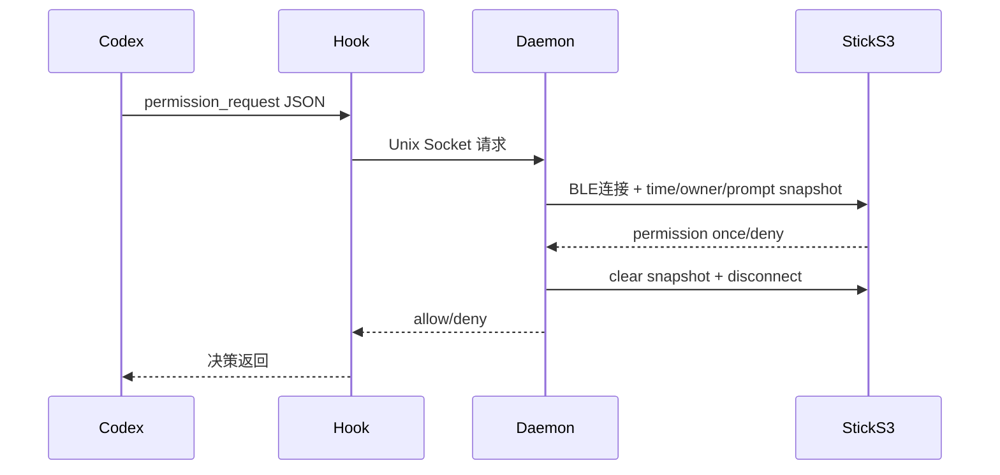

# PRD：Codex Buddy Bridge + Claude Desktop Buddy S3（双项目整合）

- 版本：v1.0
- 日期：2026-05-03
- 负责人：Arnold / Codex
- 文档范围：`codex-buddy-bridge`（主机侧）+ `claude-desktop-buddy-s3`（设备侧）

---

## 1. 产品定义

### 1.1 背景
当前 Codex 的权限审批主要在桌面端弹窗中完成。目标是将审批动作下沉到实体设备（M5StickC Plus S3），通过 BLE 实现“抬手即批/拒”，减少打断。

### 1.2 产品目标
1. 将 Codex `PermissionRequest` 审批流程实时映射到硬件设备。
2. 在审批结束后设备快速回到标准页面流，不卡审批态。
3. 在 idle 条件下稳定显示时钟与状态信息。
4. 保持与 Claude Desktop Buddy 协议兼容，尽量零固件协议改动。

### 1.3 非目标
1. 不改 Codex 官方审批协议。
2. 不实现多设备并发连接同一 Buddy（BLE 单连接限制）。
3. 不在本期实现云端同步或远程控制。

---

## 2. 用户与场景

### 2.1 目标用户
- 高频使用 Codex CLI/Desktop 的开发者。
- 使用 M5StickC Plus S3 做桌面交互外设的 maker。

### 2.2 关键场景
1. Codex 执行敏感命令前触发审批，设备弹出 prompt，用户按 A 通过或 B 拒绝。
2. 无审批时设备显示 normal/info/pet 页面；idle + USB + RTC valid 进入时钟页。
3. BLE 被占用或设备不在线时，桥接返回 `no_buddy`，Codex 自动回退原生审批。

---

## 3. 系统总览（图）

```mermaid
flowchart LR
    A[Codex CLI/Desktop]\nPermissionRequest Hook --> B[permission_request.py]
    B --> C[/tmp/codex-buddy.sock]
    C --> D[codex-buddy-bridge daemon]
    D --> E[BLE NUS Transport]
    E --> F[M5StickC Plus S3 Firmware]
    F -->|A/B 按键决策| D
    D -->|allow/deny/no_buddy| B
    B --> A
```



---

## 4. 视觉与交互（图文）

### 4.1 审批页（设备端）


### 4.2 宠物信息页


### 4.3 设备 Credits 页


### 4.4 交互规则（当前实现）
- A 键：审批页为 approve；其余页面切页。
- B 键：审批页为 deny；其余页面翻页/子页。
- 审批完成后：立即退出审批页，回到标准 3 页流。

---

## 5. 功能需求（FR）

### FR-1 审批桥接
1. Daemon 接收 hook 事件后，按需连接 BLE，不长期占用连接。
2. 发送 `prompt snapshot` 到设备，等待按键决策。
3. 返回 `allow` / `deny`；异常返回 `no_buddy` 或 `timeout`。

### FR-2 设备审批态管理
1. 审批页显示条件以“是否仍待审批”为准（而非仅 `promptId` 存在）。
2. 用户按 A/B 后本地立即清除 prompt 可视态，避免卡页。
3. 后续新 prompt 到达时可再次正常弹出。

### FR-3 Idle 时钟显示
1. 满足 `displayMode=normal && running=0 && waiting=0 && RTC valid && USB in` 时进入时钟。
2. 时钟时间优先使用 host 同步时间（epoch+tz），保障上电后可用。
3. 方向与普通 UI 方向映射一致，不出现反向显示。

### FR-4 信息页与状态页
1. 保留 normal / info / buddy 三大主页面流。
2. info 下支持多子页（设备、电源、统计、版本等）。
3. 页面切换不影响 BLE 通信与审批能力。

---

## 6. 角色状态机（设备侧）

### 6.1 基础状态
- `sleep`：未连接或休眠表现。
- `idle`：连接正常且无待处理工作。
- `busy`：存在运行中任务。
- `attention`：存在等待审批任务。
- `celebrate`：完成里程碑后短暂庆祝。
- `dizzy` / `heart`：动作触发的一次性状态动画。

### 6.2 优先级原则
1. 审批等待（attention）优先于普通 idle/busy 表达。
2. 一次性状态（如 heart）可短时覆盖基础状态。
3. 审批结束后状态应立即回落到基础态。

---

## 7. 非功能需求（NFR）

1. 稳定性：审批回路在 BLE 不可用时必须快速失败并回退，不阻塞 Codex。
2. 性能：单次审批 BLE 建连 + 决策往返目标 3~5 秒内完成（环境依赖）。
3. 可维护性：桥接端与固件端保持协议层解耦。
4. 可观测性：daemon 提供 debug 日志，便于定位扫描/建连/决策阶段问题。

---

## 8. 异常与容错

1. 设备被其他 central 占用：返回 `no_buddy`，Codex 回退原生审批。
2. BLE 扫描不到设备：返回 `No BLE device found with prefix`。
3. 用户超时未按键：返回 `timeout`。
4. clear snapshot 延迟：设备端仍应依赖本地状态修正立即退页。

---

## 9. 验收标准（UAT）

1. 触发审批后设备能在 8 秒内弹出 prompt（正常 BLE 条件）。
2. A/B 决策后设备立即退出审批页，无需再次按键。
3. idle 条件满足时可进入时钟，时间与主机一致（含时区偏移）。
4. BLE 不可用时 Codex 仍能弹原生审批，不卡死。
5. 连续两次审批均可正常弹出、处理、清理。

---

## 10. 版本里程碑

### M1（已完成）
- Codex hook 到 BLE 设备的端到端审批闭环。
- 基础页面与宠物状态显示。

### M2（已完成）
- 审批后立即退页。
- idle 时钟恢复与 host 时间同步兜底。

---

## 11. 代码边界与职责

### `codex-buddy-bridge`
- `daemon.py`：审批主流程、BLE 会话生命周期、time/owner/snapshot 帧发送。
- `ble_transport.py`：NUS 连接、读写、断连管理。
- `ipc.py`：Unix socket 服务，接收 hook 请求。
- `hooks/permission_request.py`：与 Codex hook 协议对接。

### `claude-desktop-buddy-s3`
- `src/main.cpp`：状态机、页面调度、按键行为。
- `src/data.h`：JSON 帧解析（snapshot/prompt/time/owner）。
- `src/ble_bridge.cpp`：BLE NUS 通道。
- `src/stats.h`：本地统计与设置持久化。

---

## 12. 后续建议

1. 增加“审批页自动关闭计时器”可配置项（如 0.5s/1s）。
2. 在 info 页展示 RTC 来源（host sync / local fallback）。
3. 提供一键诊断脚本，串联 daemon、BLE 扫描、socket 回环测试。

